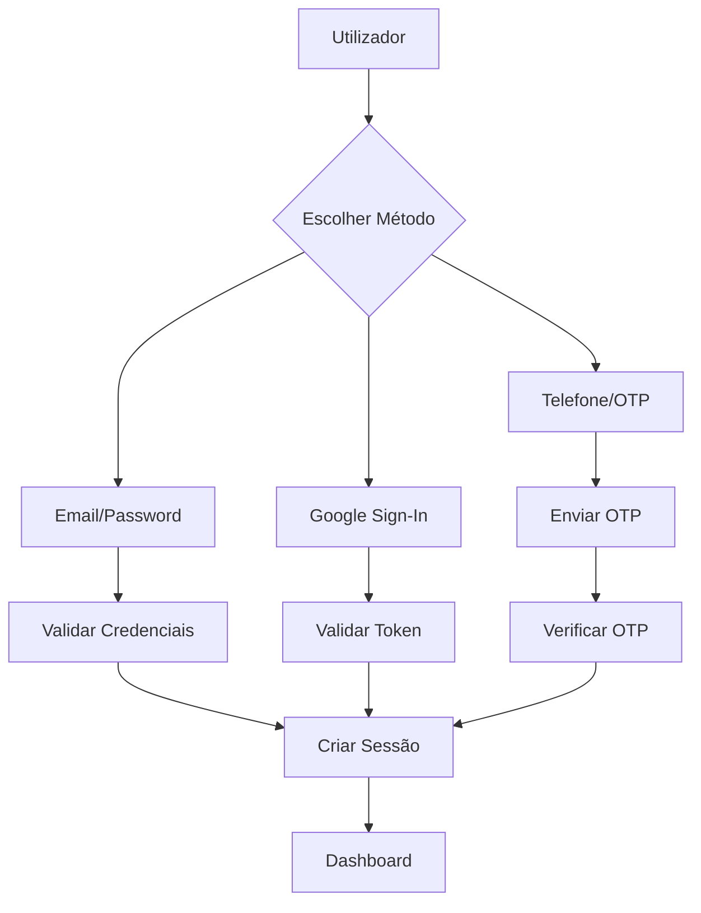

# 📱 Wishlist App

Uma aplicação Flutter moderna para gestão de listas de desejos, com autenticação segura, web scraping inteligente e interface Material 3.

## 🚀 Características

### ✨ **Funcionalidades Principais**
- 🔐 **Autenticação Múltipla**: Email, telefone e Google Sign-In
- 📋 **Gestão de Wishlists**: Criar, editar e organizar listas de desejos
- 🛍️ **Web Scraping Inteligente**: Extração automática de preços e informações de produtos
- 📸 **Upload de Imagens**: Suporte para imagens locais e URLs
- 🎨 **Interface Moderna**: Material 3 Design com animações suaves
- 🔄 **Sincronização em Tempo Real**: Supabase Realtime para atualizações instantâneas
- 📱 **Apenas Android**: Otimizada especificamente para dispositivos Android

### 🛡️ **Segurança**
- **Validação de Dados**: Sanitização completa de inputs
- **Rate Limiting**: Proteção contra abuso de API
- **Edge Functions**: Web scraping seguro no servidor
- **RLS Policies**: Row Level Security no Supabase
- **Validação de Imagens**: Magic bytes e tipo MIME

### ⚡ **Performance**
- **Lazy Loading**: Carregamento otimizado de imagens
- **Cache Inteligente**: Sistema de cache local
- **Otimização de Imagens**: Compressão automática
- **Animações Suaves**: Transições fluidas

## 📋 Pré-requisitos

- **Flutter SDK**: ^3.8.1
- **Dart**: ^3.8.1
- **Android Studio** ou **VS Code**
- **Conta Supabase** (gratuita)
- **Dispositivo Android** ou **Emulador**

## 🛠️ Instalação

### 1. **Clone o Repositório**
```bash
git clone https://github.com/seu-usuario/wishlist_app.git
cd wishlist_app
```

### 2. **Instalar Dependências**
```bash
flutter pub get
```

### 3. **Configurar Supabase**

#### 3.1 Criar Projeto Supabase
1. Aceda a [supabase.com](https://supabase.com)
2. Crie um novo projeto
3. Anote o **URL** e **anon key**

#### 3.2 Configurar Variáveis de Ambiente
Crie um arquivo `.env` na raiz do projeto:

```env
SUPABASE_URL=sua_url_do_supabase
SUPABASE_ANON_KEY=sua_chave_anonima
GOOGLE_SIGN_IN_SERVER_CLIENT_ID=seu_client_id_google
SCRAPER_API_KEY=sua_chave_scraper_api
```

#### 3.3 Configurar Google Sign-In
1. Aceda ao [Google Cloud Console](https://console.cloud.google.com)
2. Crie um projeto ou use um existente
3. Ative a API Google Sign-In
4. Configure as credenciais OAuth 2.0
5. Adicione o SHA-1 do seu projeto Android

### 4. **Executar a Aplicação**
```bash
flutter run
```

## 🏗️ Arquitetura do Projeto

```
lib/
├── config.dart                 # Configurações da aplicação
├── main.dart                   # Ponto de entrada
├── theme.dart                  # Temas Material 3
├── models/                     # Modelos de dados
│   ├── category.dart
│   ├── sort_options.dart
│   ├── wish_item.dart
│   └── wishlist.dart
├── screens/                    # Telas da aplicação
│   ├── login_screen.dart
│   ├── register_screen.dart
│   ├── otp_screen.dart
│   ├── wishlists_screen.dart
│   ├── wishlist_details_screen.dart
│   ├── add_edit_item_screen.dart
│   ├── add_edit_wishlist_screen.dart
│   ├── profile_screen.dart
│   ├── explore_screen.dart
│   └── ...
├── services/                   # Serviços e lógica de negócio
│   ├── auth_service.dart
│   ├── supabase_database_service.dart
│   ├── supabase_storage_service.dart
│   ├── web_scraper_service.dart
│   ├── user_service.dart
│   ├── error_service.dart
│   ├── cache_service.dart
│   └── ...
└── widgets/                    # Widgets reutilizáveis
    ├── wish_item_tile.dart
    ├── wishlist_total.dart
    ├── lazy_image.dart
    ├── skeleton_loading.dart
    ├── animated_widgets.dart
    ├── ui_components.dart
    └── ...
```

## 🔧 Configuração do Supabase

### Estrutura da Base de Dados

#### Tabela `users`
```sql
CREATE TABLE users (
  id UUID PRIMARY KEY DEFAULT gen_random_uuid(),
  email TEXT UNIQUE,
  phone_number TEXT UNIQUE NOT NULL,
  display_name TEXT,
  bio TEXT,
  avatar_url TEXT,
  created_at TIMESTAMP WITH TIME ZONE DEFAULT NOW(),
  updated_at TIMESTAMP WITH TIME ZONE DEFAULT NOW()
);
```

#### Tabela `wishlists`
```sql
CREATE TABLE wishlists (
  id UUID PRIMARY KEY DEFAULT gen_random_uuid(),
  user_id UUID REFERENCES users(id) ON DELETE CASCADE,
  name TEXT NOT NULL,
  description TEXT,
  is_public BOOLEAN DEFAULT false,
  created_at TIMESTAMP WITH TIME ZONE DEFAULT NOW(),
  updated_at TIMESTAMP WITH TIME ZONE DEFAULT NOW()
);
```

#### Tabela `wish_items`
```sql
CREATE TABLE wish_items (
  id UUID PRIMARY KEY DEFAULT gen_random_uuid(),
  wishlist_id UUID REFERENCES wishlists(id) ON DELETE CASCADE,
  name TEXT NOT NULL,
  description TEXT,
  price DECIMAL(10,2),
  image_url TEXT,
  product_url TEXT,
  priority INTEGER DEFAULT 1,
  is_purchased BOOLEAN DEFAULT false,
  created_at TIMESTAMP WITH TIME ZONE DEFAULT NOW(),
  updated_at TIMESTAMP WITH TIME ZONE DEFAULT NOW()
);
```

### Edge Functions

#### `secure-scraper`
```typescript
// supabase/functions/secure-scraper/index.ts
// Web scraping seguro com validação de domínios
```

#### `delete-user`
```typescript
// supabase/functions/delete-user/index.ts
// Eliminação segura de contas de utilizador
```

## 📱 Funcionalidades Detalhadas

### 🔐 **Sistema de Autenticação**

#### Métodos de Login
1. **Email/Password**: Registro e login tradicional
2. **Telefone/OTP**: Autenticação via SMS
3. **Google Sign-In**: Login social integrado

#### Fluxo de Autenticação


### 📋 **Gestão de Wishlists**

#### Operações Disponíveis
- ✅ Criar nova wishlist
- ✅ Editar wishlist existente
- ✅ Eliminar wishlist
- ✅ Partilhar wishlist (pública/privada)
- ✅ Adicionar/remover items
- ✅ Marcar como comprado
- ✅ Definir prioridades

#### Estrutura de Dados
```dart
class Wishlist {
  final String id;
  final String name;
  final String? description;
  final bool isPublic;
  final DateTime createdAt;
  final List<WishItem> items;
}
```

### 🛍️ **Web Scraping Inteligente**

#### Domínios Suportados
- Amazon (PT, ES, FR, UK)
- eBay (PT, ES, FR, UK)
- Fnac (PT, ES, FR)
- Worten (PT, ES)
- PCDiga (PT)
- GlobalData (PT)
- E mais...

#### Processo de Scraping
1. **Validação de URL**: Verificar domínio permitido
2. **Edge Function**: Scraping seguro no servidor
3. **Fallback**: ScraperAPI se Edge Function falhar
4. **Sanitização**: Limpeza de dados extraídos
5. **Cache**: Armazenamento local para performance

### 📸 **Sistema de Imagens**

#### Funcionalidades
- **Upload Local**: Seleção da galeria/câmara
- **Upload por URL**: Link direto para imagem
- **Otimização Automática**: Compressão e redimensionamento
- **Validação de Segurança**: Magic bytes e tipo MIME
- **Cache Inteligente**: Armazenamento local

#### Formatos Suportados
- JPEG/JPG
- PNG
- WebP
- GIF

## 🎨 Interface do Utilizador

### Material 3 Design
- **Tema Dinâmico**: Suporte para modo claro/escuro
- **Cores Adaptativas**: Paleta de cores personalizada
- **Tipografia Consistente**: Hierarquia visual clara
- **Componentes Reutilizáveis**: Widgets padronizados

### Animações
- **Transições Suaves**: Entre telas e estados
- **Loading States**: Indicadores visuais de carregamento
- **Skeleton Loading**: Placeholders animados
- **Micro-interações**: Feedback visual imediato

### Widgets Principais
```dart
// AppBar personalizado
WishlistAppBar(title: "Minhas Wishlists")

// Botão com loading
WishlistButton(
  text: "Adicionar Item",
  isLoading: true,
  onPressed: () => _addItem(),
)

// Campo de texto estilizado
WishlistTextField(
  label: "Nome do Item",
  validator: _validateName,
)

// Estado vazio
WishlistEmptyState(
  icon: Icons.shopping_bag,
  title: "Nenhum item encontrado",
  subtitle: "Adicione o seu primeiro item à wishlist",
  actionText: "Adicionar Item",
  onAction: () => _addItem(),
)
```

## 🔧 Desenvolvimento

### Estrutura de Código

#### Convenções de Nomenclatura
- **Arquivos**: `snake_case.dart`
- **Classes**: `PascalCase`
- **Variáveis**: `camelCase`
- **Constantes**: `UPPER_SNAKE_CASE`

#### Organização de Imports
```dart
// Dart imports
import 'dart:io';
import 'dart:convert';

// Flutter imports
import 'package:flutter/material.dart';
import 'package:flutter/foundation.dart';

// Third-party packages
import 'package:supabase_flutter/supabase_flutter.dart';
import 'package:google_sign_in/google_sign_in.dart';

// Local imports
import 'package:wishlist_app/config.dart';
import 'package:wishlist_app/services/auth_service.dart';
```

### Testes

#### Estrutura de Testes
```
test/
├── unit/
│   ├── services/
│   ├── models/
│   └── utils/
├── widget/
│   ├── screens/
│   └── widgets/
└── integration/
    └── app_test.dart
```

#### Executar Testes
```bash
# Testes unitários
flutter test

# Testes de widget
flutter test test/widget/

# Testes de integração
flutter test test/integration/
```

### Debugging

#### Logs Estruturados
```dart
// Usar debugPrint em vez de print
debugPrint('Carregando wishlists do utilizador: $userId');

// Logs de erro centralizados
ErrorService.logError('auth_failed', error, stackTrace);
```

#### Performance Monitoring
```dart
// Monitorizar performance
PerformanceService.recordOperation('load_wishlists', () async {
  // Operação a monitorizar
});
```

## 🚀 Deploy

### Preparação para Produção

#### 1. **Otimizações**
```bash
# Build otimizado
flutter build apk --release

# Verificar tamanho
flutter build apk --analyze-size
```

#### 2. **Configurações de Produção**
- ✅ Remover logs de debug
- ✅ Otimizar imagens
- ✅ Configurar ProGuard
- ✅ Testar em dispositivos reais

#### 3. **Google Play Store**
1. Criar conta de desenvolvedor
2. Preparar assets (ícones, screenshots)
3. Configurar privacy policy
4. Submeter para revisão

### Variáveis de Ambiente

#### Desenvolvimento
```env
SUPABASE_URL=https://dev-project.supabase.co
SUPABASE_ANON_KEY=dev_anon_key
DEBUG=true
```

#### Produção
```env
SUPABASE_URL=https://prod-project.supabase.co
SUPABASE_ANON_KEY=prod_anon_key
DEBUG=false
```

## 📊 Monitorização e Analytics

### Métricas de Performance
- **Tempo de Carregamento**: Startup e operações
- **Uso de Memória**: Monitorização de recursos
- **Taxa de Erro**: Tracking de crashes
- **Engagement**: Interações do utilizador

### Logs Estruturados
```dart
// Categorização de erros
ErrorService.logError('network_timeout', error, stackTrace);
ErrorService.logError('auth_failed', error, stackTrace);
ErrorService.logError('storage_upload_failed', error, stackTrace);
```

## 🔒 Segurança

### Medidas Implementadas
- **Validação de Input**: Sanitização de todos os dados
- **Rate Limiting**: Proteção contra abuso
- **HTTPS Only**: Comunicação encriptada
- **RLS Policies**: Segurança a nível de base de dados
- **Magic Bytes**: Validação de tipos de arquivo

### Boas Práticas
- ✅ Nunca expor chaves de API no código
- ✅ Validar todos os inputs do utilizador
- ✅ Usar HTTPS para todas as comunicações
- ✅ Implementar rate limiting
- ✅ Logs de auditoria

## 🤝 Contribuição

### Como Contribuir
1. **Fork** o projeto
2. **Crie** uma branch para a feature (`git checkout -b feature/AmazingFeature`)
3. **Commit** as mudanças (`git commit -m 'Add some AmazingFeature'`)
4. **Push** para a branch (`git push origin feature/AmazingFeature`)
5. **Abra** um Pull Request

### Padrões de Código
- Seguir as convenções de nomenclatura
- Adicionar testes para novas funcionalidades
- Documentar código complexo
- Manter a cobertura de testes > 80%

## 📄 Licença

Este projeto está licenciado sob a Licença MIT - veja o arquivo [LICENSE](LICENSE) para detalhes.

## 🆘 Suporte

### Problemas Comuns

#### Erro de Autenticação
```bash
# Verificar configuração do Google Sign-In
flutter clean
flutter pub get
```

#### Problemas de Build
```bash
# Limpar cache
flutter clean
flutter pub get
flutter build apk --release
```

#### Erro de Supabase
1. Verificar URL e chave no `.env`
2. Confirmar configuração do projeto
3. Verificar políticas RLS

### Contacto
- **Email**: suporte@wishlistapp.com
- **Issues**: [GitHub Issues](https://github.com/seu-usuario/wishlist_app/issues)
- **Documentação**: [Wiki](https://github.com/seu-usuario/wishlist_app/wiki)

## 🙏 Agradecimentos

- **Flutter Team** pelo framework incrível
- **Supabase** pela infraestrutura backend
- **Material Design** pelo sistema de design
- **Comunidade Flutter** pelo suporte contínuo

---

**Desenvolvido com ❤️ para a comunidade Flutter**
